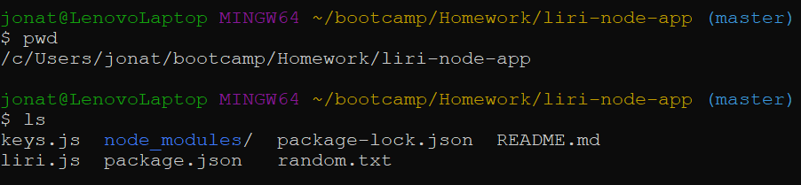
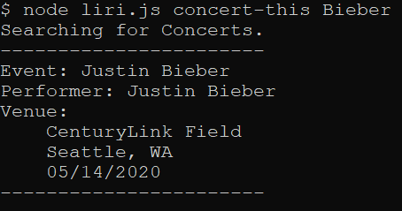
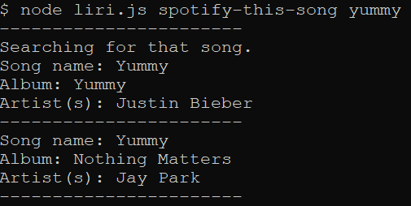
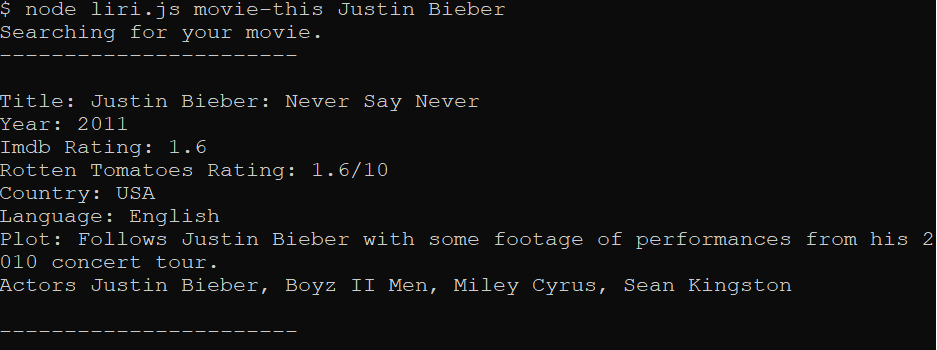

# liri-node-app
Language Interpretation and Recognition Interface that will search Spotify for songs, SeatGeek for concerts, and OMDB for movies.

### Instructions
1. Open your terminal (such as Bash or Terminal).

2. Navigate to the folder that contains the `liri.js` file. 

3. Use LIRI by using this format: 
     
        `node liri.js [command] [parameter]`
     
- `[Commands]` include:
    - `concert-this`: The system will display a list of all events and locations where the artist or band will perform. It can result in multiple records.
    - `spotify-this-song`: The system will display a list of information associated with the song. It can result in multiple records.
    - `movie-this`: The system will display information associated with the movie. 
    - `do-what-it-says`: The system will read the text in the random.txt file, and perform the command listed in the random.txt file.
    
    
    
- `[parameters]`: is any concert/song/movie to search for.
    
- - -
## TECHNOLOGIES USED
* Javascript
* Nodejs
* Node packages:
    * Node-Spotify
    * Moment
    * DotEnv
    * Axios
* APIs used:
    * Seat Geek
    * OMDB
* Git
* GitHub